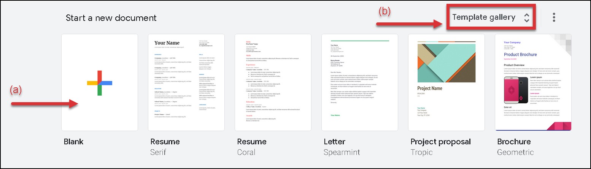

# Creating a new document
1. Log in to your Google account and open the [Google Docs](http://docs.google.com) website in your browser.
2. Click the **Blank** icon to create empty document (a).  
Click the **Templates gallery** to use one of the pre-existing Google's templates (b).  