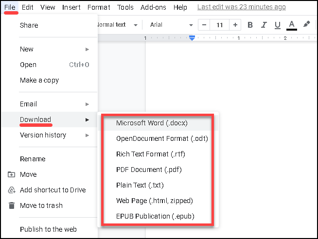
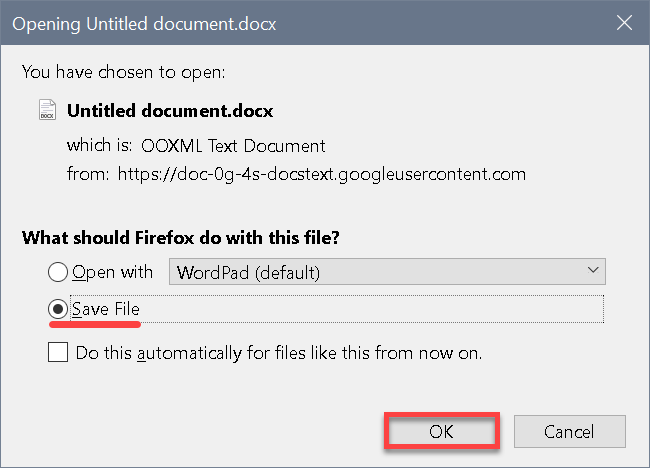

# Downloading a document
1. In Google Docs menu, click **File > Download**. From the drop-down menu, select the type of file to download.  

4. Select **Save File** and click **OK**. The file will be downloaded into your operating system's downloads folder. 
