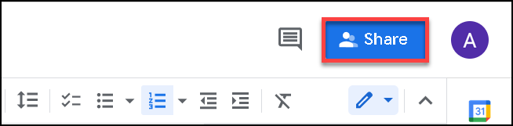
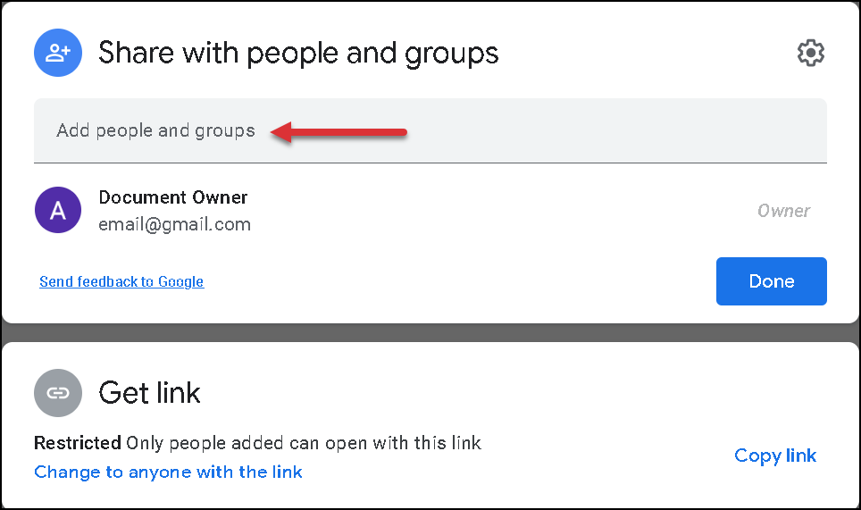
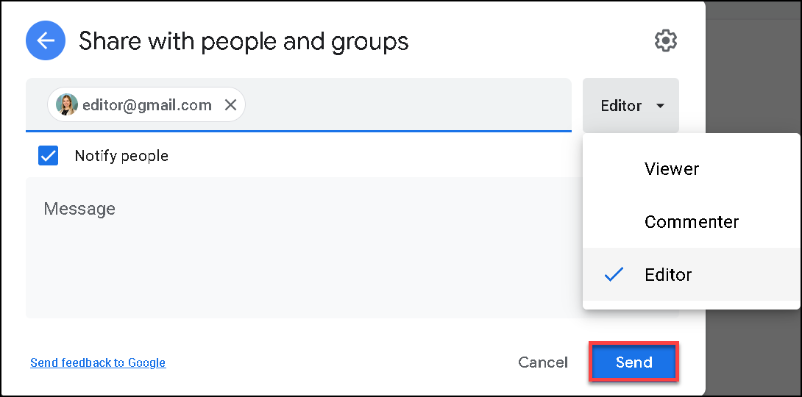
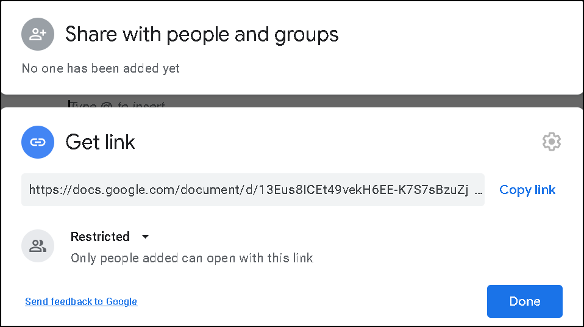
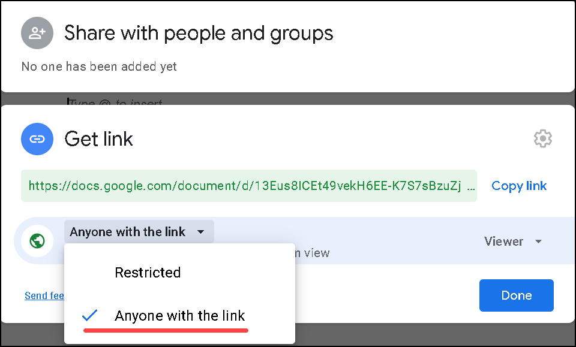
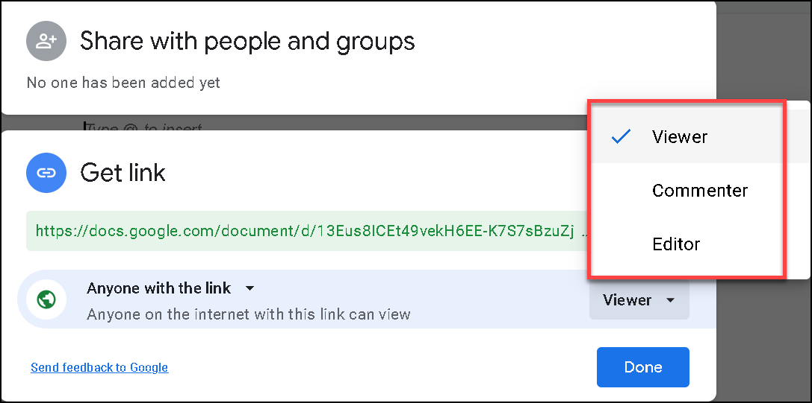

# Managing access

In Google Docs, you can share a document with your teammates and manage the access rights for them.

## Sharing a document by email  
1. In Google document, click the **Share** button.  
2. In the opened window, people you have shared the document with, and their access rights, are displayed.
3. To add new people, type an email address, or a name of your contacts into the text field and press ENTER.  
4. In the drop-down menu toward your teammates names, manage their access rights by choosing one of the corresponding values and click **Send** (see the table with the access modes description below). Select **Notify people** checkbox to notify your teammates by email. Optionally, attach a message to your teammates by typing a text into the **Message** field.   

| Access mode | Description |
| ----------- | ----------- |
| Viewer      | Allowed to only view a document |
| Commenter   | Allowed to view and leave the comments in a document|
| Editor      | Allowed to change a document |
| Transfer ownership | Change the owner of a document |
| Remove | Denied the access to a document for a user | 

## Sharing a document by direct link

1. In Google document, click the **Share** button. 
2. Click the **Get link** tab.  
3. Change the **Restricted** to **Anyone with a link** option.  
4. Set up the access mode and click **Done**. 
5. Copy the link and send it to your teammates.
