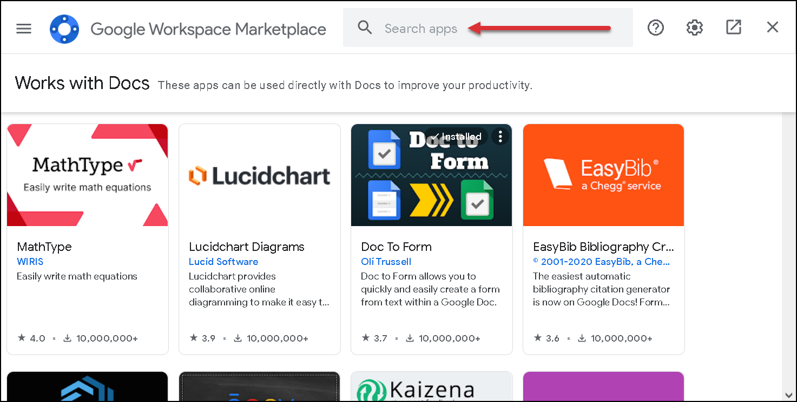
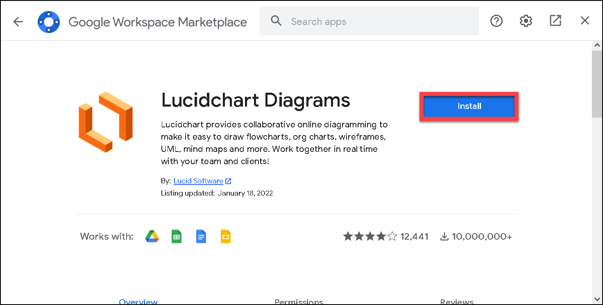
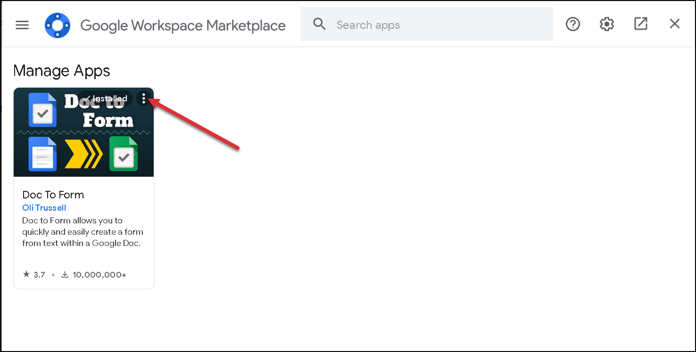
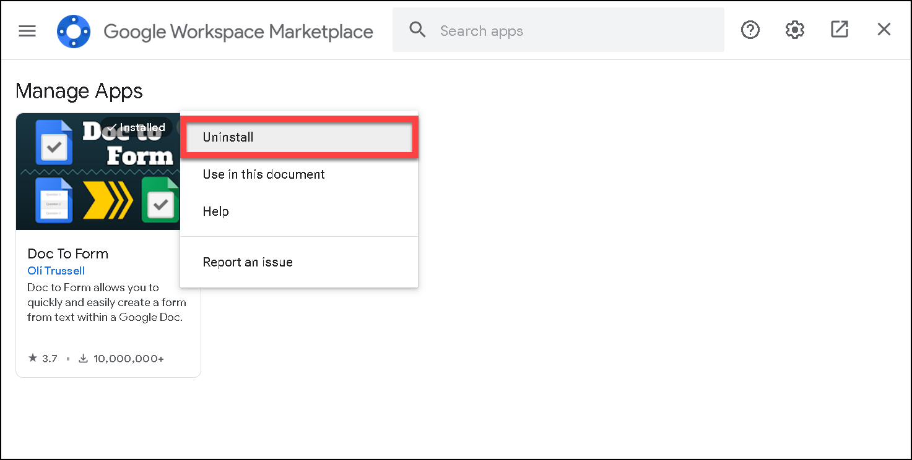
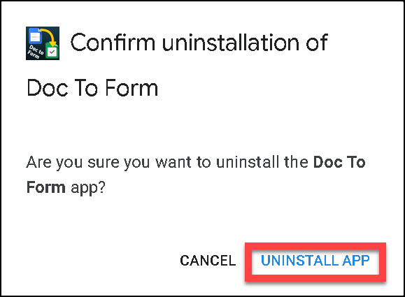

# Managing add-ons
It is possible to extend functionality of Google Docs with add-ons. Add-ons can be installed from Google Workspace Marketplace.

## Installing add-ons

1. In Google Document, click **Add-ons > Get add-ons**.
2. Use the search bar to find add-on.  
3. On the add-on page, click the **Install** button and follow the installation instruction. Installing add-ons will be placed in the **Add-ons** menu tab.  

## Uninstalling add-ons
1. In Google document, click **Add-ons > Manage add-ons**.
2. Click the **Option** icon on the add-on pictogramm.  
3. Select **Uninstall**.  
4. Confirm that you want to uninstall the add-on. 