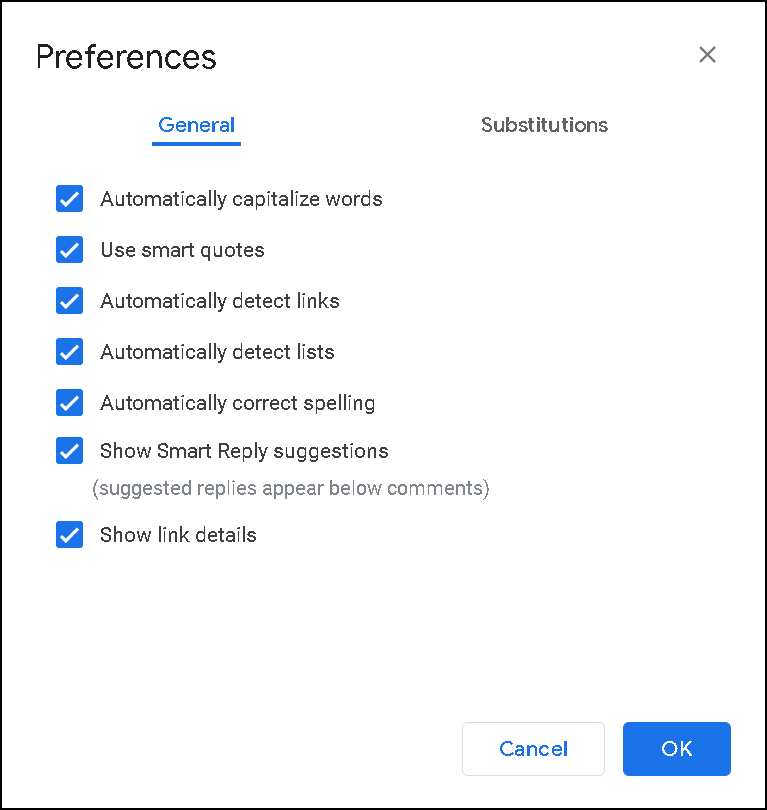
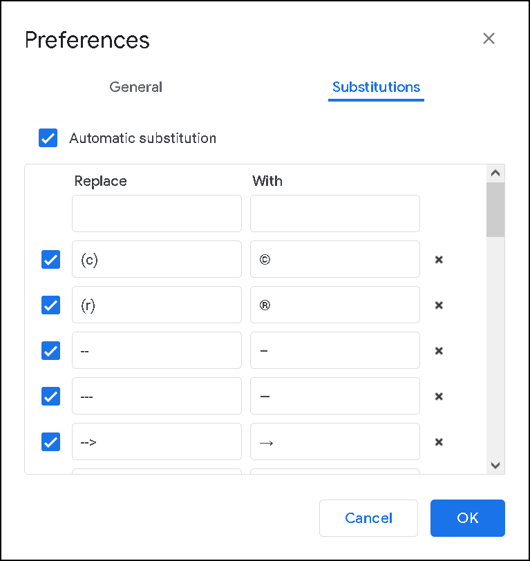

# Managing settings

1. Click **Tools > Preferences**.
2. In the **General** tab, select the required checkboxes (see the table below).  
3. In the **Substitution** tab, you can set up your custom substitution for words or symbols.  

| **Option**      | **Description** |
| ----------- | ----------- |
| Automatically capitalize words| Starts a new sentences with a capital letter |
| Use smart quotes | Automatically changes straight quotation marks ( ' or " ) to curly ( ‘ or “ ) |
| Automatically detect links | Automatically applies link formatting to a web addresses |
| Automatically detect lists | Automatically applies list formatting to a numbered items |
| Automatically correct spelling | Automatically changes wrong spelling to a correct |
| Show Smart Reply suggestions | Suggested replies appear below comments |
| Show link details | Web page’s description appears when cursor is pointed to a link |