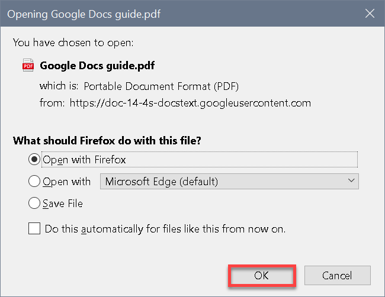
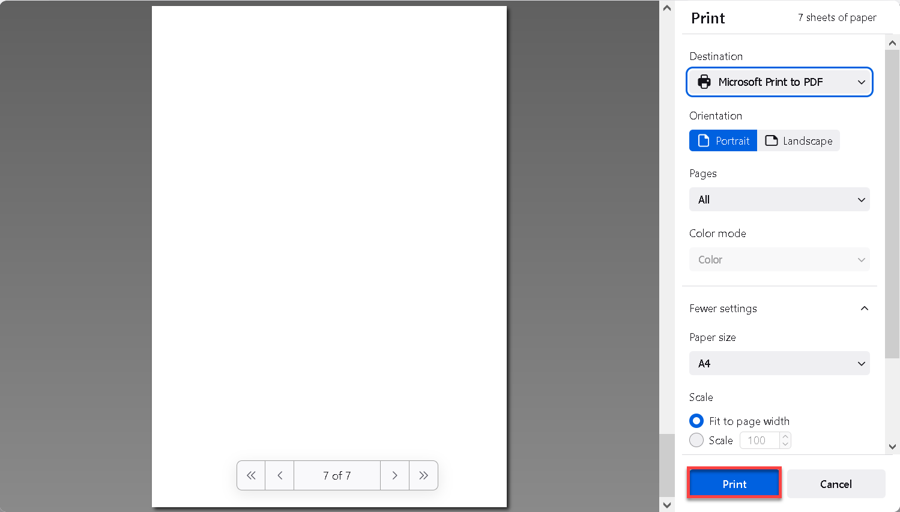

# Printing a document

1. In Google Docs menu, Click **File > Print**.
2. In the appeared dialog, choose **Save File** to download the file or **Open with _'specified application_'** to open the file without downloading, then click **OK**. 
3. Open the file and click the **Print** icon at top-right corner.

4. In the appeared window, specify the print parameters and click **Print**.  
